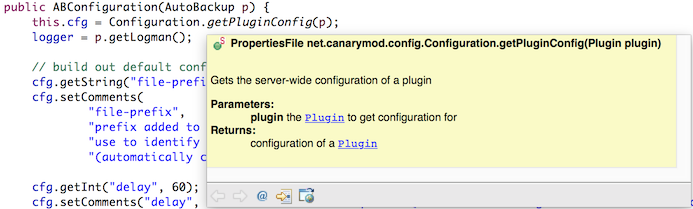
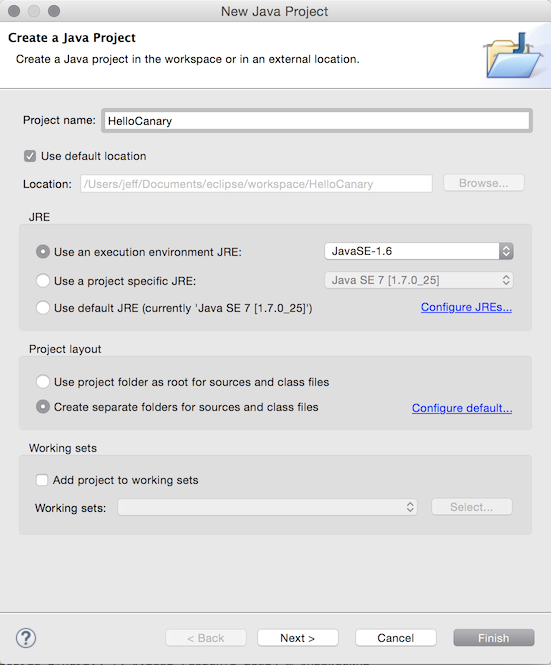
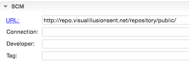
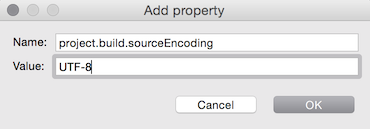
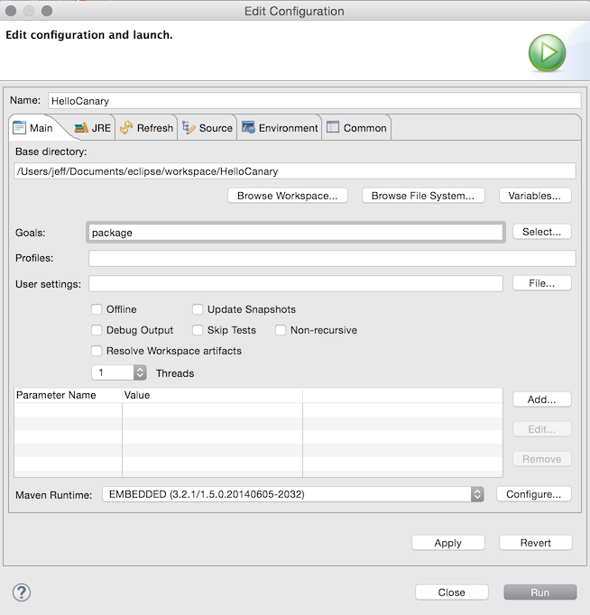

title: "How to write CanaryMod plugins using Eclipse"
date: 2015-01-30 21:04:07
---
This is a detailed guide for setting up Eclipse to develop CanaryMod plugins. [CanaryMod](http://canarymod.net) is a Minecraft server implementation with a powerful API layer on top. Similar in principle to [CraftBukkit](http://bukkit.org/) and [Spigot](http://www.spigotmc.org/) but without the [legal baggage](http://dl.bukkit.org/dmca/notification.txt).

We will start with setting up the environment, building a simple yet functional plugin and finally publishing to Github. I wrote this tutorial on Mac OS X (go Apple!) but similar instructions should apply for Windows/Linux folks.

## Requirements
- [Java SE SDK](http://www.oracle.com/technetwork/articles/javase/index-jsp-138363.html).
- [Eclipse IDE for Java Developers](http://www.eclipse.org/downloads/): this tutorial is based on version 4.4. The Java Developer version contains Maven and Git integration that are both necessary for this tutorial.
- A [Github account](http://github.com) (optional): it's free! And open source is great.
- Enable JavaDocs from Maven repositories: Eclipse supports referencing JavaDocs from Maven repositories and integrating into your IDE. To enable this integration in Eclipse go to: Preferences > Maven, tick "Download Artifact JavaDoc" and click OK.

Once you have the requirements installed and running, launch Eclipse to get ready to make your first CanaryMod plugin!

## Set up the project
Each plugin will be contained in a standalone project in Eclipse. Let's set that up now:

1. In the Eclipse menu, go to: File > New > Java Project.
2. Give the project a name - this will be the "marketing" name of your cool plugin, and ideally will match the Github repository name when you're done.
3. Set "Use an execution environment JRE" to **JavaSE-1.6**. This will be the minimum Java JRE version your plugin runs on. You can target higher Java versions, but will need to [note that in your post](http://canarymod.net/forum/plugins-board/plugineer-requests/readme-before-making-request-3241) when you publish your plugin.
4. Leave the rest at defaults, click Next.
5. Click Finish.

*The handbook adds the CanaryLib.jar to the Libraries here. Do not do this, we will pull CanaryLib in as a Maven dependency further on.*

## Convert project to Maven
Your project is now created, but let's hook Maven up to CanaryLib so you can begin coding:
1. Go to Package Explorer (on the left) and right click your project.
2. Go to Configure > Convert to Maven Project.
3. Set the group ID to your website's domain name if you have one (e.g. com.poweredbyjeff).
4. Copy the artifact ID down to Name and optionally set a description.
5. Click Finish. You should now be able to see a pom.xml file in your Package Explorer.

## Configure Maven
Double-click to open the pom.xml file. In the Overview tab:
1. Copy/paste http://repo.visualillusionsent.net/repository/public/ into SCM>URL.
2. Under Properties, click Create. Set name to project.build.sourceEncoding and value to UTF-8 , click OK.

3. Go to the Dependencies tab. Click Add under Dependencies (**not Dependency Management!!**).
4. Configure fields as follows:
  - Group ID = net.canarymod
  - Artifact ID = CanaryLib
  - Version ID = [1.0.0,)
5. Leave the rest as default and click OK.
6. Go to the menubar and hit File > Save to save your pom.xml.

More information about Maven can be found in the [CanaryMod handbook](http://canarymod.net/books/canarymod-development/introduction-using-maven-canarymod).

## A basic plugin

You are now ready to do the fun part - writing your cool plugin! Until I've expanded this section, work through the [Hello World example in the Canary Handbook](http://canarymod.net/books/api-reference/creating-hello-world).

*Remember to ignore the bit about adding CanaryLib at the start; begin from "do the packages" and come back here when you're ready to create a jar.*

## Creating the jar file
The "package" target is the one that actually creates the jar file, but unfortunately isn't in the default list of Run targets. To build the jar the first time, go to the Package Explorer:
- Right click your project > Run As... > Maven Build...
- Put the word "package" in the goal box.
- Click run.

After this first run, you can just use Run As... > Maven Build (note the missing elipsis) to rebuild your jar file. Happy plugineering!

## Todo
- Make a tl,dr version that bootstraps a project (possibly a pre-made pom.xml generator or ready for import Eclipse project).
- Do rest of plugin creation instead of referring to handbook.
- Write up Github publishing portion.

## Changelog
- Wrote page. Drank beer.

*This guide is largely inspired by the [official CanaryMod handbooks](http://canarymod.net/books/). Kudos to the relatively small CanaryMod team for building and continuing to maintain such a large project!*